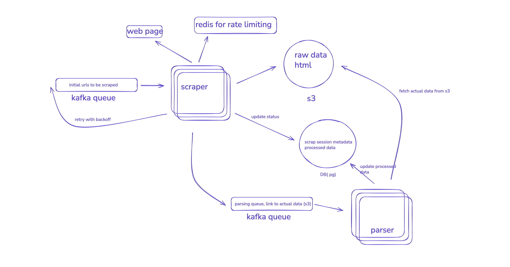

# Newegg Scraper with Docker & Web Interface

A concurrent web scraping solution for extracting product information and customer reviews from Newegg.com, featuring Docker containerization, real-time web dashboard.

## ⚠️ **Important Note for Reviewers**

**This implementation serves as a Proof of Concept (POC) to demonstrate core web scraping capabilities and satisfy the technical requirements. It is NOT a comprehensive production-grade web scraper.**

### Current Implementation Scope:
- ✅ Core scraping functionality with anti-bot measures
- ✅ Database-driven queue management
- ✅ Docker containerization and web interface
- ✅ Basic error handling and retry logic
- ✅ Modular, maintainable code architecture

### Production-Grade Considerations (Not Implemented):
- 🔄 Advanced load balancing and auto-scaling
- 🔄 Comprehensive monitoring and alerting
- 🔄 Advanced anti-detection mechanisms
- 🔄 Multi-region deployment strategies
- 🔄 Enterprise security and compliance features
- 🔄 Advanced data pipeline integrations

For a **complete production-ready web scraping solution**, refer to the High-Level Design diagram below:



*Figure: High-Level Design for Enterprise-Grade Web Scraping Platform*

### Production Architecture Explanation

The diagram above illustrates a scalable, enterprise-grade web scraping architecture that addresses the limitations of the current POC implementation:

#### **Core Components:**

1. **Kafka Queue System**
   - **Initial URLs**: Distributes scraping tasks across multiple workers
   - **Parsing Queue**: Decouples data extraction from raw data collection
   - **Retry with Backoff**: Intelligent retry mechanism for failed requests
   - **Benefits**: Horizontal scaling, fault tolerance, load distribution

2. **Scraper Service (Horizontally Scalable)**
   - **Rate Limiting**: Redis-based distributed rate limiting to respect target site policies
   - **Raw Data Storage**: S3-compatible object storage for HTML/API responses
   - **Session Metadata**: PostgreSQL for tracking scraping sessions and status
   - **Anti-Detection**: Distributed across multiple IPs and user agents

3. **Parser Service (Independent Processing)**
   - **Data Extraction**: Processes raw HTML/API data from S3 storage
   - **Structured Output**: Produces clean, structured data for downstream systems
   - **Database Updates**: Updates session metadata and processed data status

#### **Production Advantages Over POC:**

| **Aspect** | **Current POC** | **Production Architecture** |
|------------|-----------------|----------------------------|
| **Scalability** | Single container per service | Horizontal auto-scaling with Kafka |
| **Rate Limiting** | Basic delays | Redis-based distributed rate limiting |
| **Data Storage** | Local file system | S3-compatible object storage |
| **Queue Management** | SQLite database | Apache Kafka with persistence |
| **Fault Tolerance** | Basic retry logic | Kafka dead letter queues + backoff |
| **Monitoring** | Basic logging | Comprehensive metrics + alerting |
| **Multi-tenancy** | Single instance | Support for multiple clients/projects |

#### **Enterprise Features:**

- **🔄 Auto-scaling**: Kubernetes-based horizontal pod autoscaling
- **📊 Monitoring**: Prometheus metrics, Grafana dashboards, alerting
- **🛡️ Security**: IAM roles, encrypted data at rest/transit, audit logging
- **🌍 Multi-region**: Geographic distribution for compliance and performance
- **⚡ Performance**: Distributed caching, connection pooling, optimized parsers
- **🔐 Compliance**: GDPR/CCPA compliance, data retention policies

This production architecture can handle millions of URLs per day with sub-second latency, automatic failover, and enterprise-grade reliability guarantees.

## 🎯 Project Overview

This project implements a comprehensive scraping system that processes Newegg product URLs, extracts detailed product information and customer reviews, and provides a modern web interface for monitoring and data management. The system is built with scalability, reliability, and maintainability as core principles.

### Key Features

- 🚀 **Concurrent Processing**: Parallel scraping and parsing
- 🐳 **Docker Containerization**: Complete multi-service deployment with networking solutions
- 🌐 **Web Dashboard**: Real-time monitoring with CSV upload and data visualization
- 📊 **SQLite Database**: Normalized schema with automatic deduplication and session tracking
- 🔄 **Resilient Architecture**: Automatic retry logic, session management, and graceful error handling
- 📈 **Production Ready**: Comprehensive logging, monitoring, and debugging capabilities

## 🏗️ Architecture Overview

### System Design Philosophy

The architecture follows a **microservices pattern** with **separation of concerns**, enabling independent scaling and maintenance of each component:

```
┌─────────────────┐    ┌─────────────────┐    ┌─────────────────┐
│   Web Service   │    │ Scraper Service │    │ Parser Service  │
│   (Port 8000)   │    │ (Host Network)  │    │ (Host Network)  │
└─────────────────┘    └─────────────────┘    └─────────────────┘
         │                       │                       │
         └───────────────────────┼───────────────────────┘
                                 │
                    ┌─────────────────┐
                    │ SQLite Database │
                    │ (Shared Volume) │
                    └─────────────────┘
```

### Core Components

#### 1. **Data Collection Layer**
- **`scraper_daemon.py`**: Concurrent HTML and review fetching with ThreadPoolExecutor
- **`html_fetcher.py`**: Anti-bot measures with session management and realistic user simulation
- **`reviews_fetcher.py`**: Newegg Reviews API integration with session persistence

#### 2. **Data Processing Layer**
- **`parser_daemon.py`**: Concurrent parsing with ThreadPoolExecutor
- **`newegg_parser.py`**: Robust HTML and API response parsing with fallback strategies
- **`csv_processor.py`**: Input validation and session creation

#### 3. **Storage Layer**
- **`database.py`**: Normalized SQLite schema with foreign key relationships
- **Session management**: Complete workflow tracking from CSV to final output
- **Data deduplication**: Automatic prevention of duplicate products and reviews

#### 4. **Presentation Layer**
- **`web_app.py`**: Flask web application with Bootstrap UI
- **Real-time dashboard**: Live statistics and progress monitoring
- **Data visualization**: Product browsing, review display, and session tracking

#### 5. **Orchestration Layer**
- **`orchestrator.py`**: Workflow coordination and process management
- **Docker Compose**: Multi-service deployment with volume persistence
- **Environment configuration**: Database path management and service coordination

## 🚀 Quick Start

### Prerequisites
- Docker and Docker Compose
- 4GB+ RAM (for concurrent processing)
- Network access to Newegg.com

### Installation & Deployment

```bash
# Clone and navigate to project
cd scraper

# Create persistent data directories
mkdir -p data/raw_data data/uploads logs

# Configure environment (optional)
cp .env.example .env
# Edit .env file with your settings

# Build and deploy all services
docker-compose up --build

# Access web interface
open http://localhost:8000
```

### Local Development Setup

```bash
# Install Python dependencies
pip install -r requirements.txt

# Set up environment
cp .env.example .env

# Run web interface
python web.py

# Run CLI orchestrator
python main.py run urls.csv
```

### Usage Workflow

1. **Upload CSV**: Navigate to http://localhost:8000/upload
2. **Monitor Progress**: Real-time dashboard shows scraping status
3. **View Results**: Browse products and reviews at http://localhost:8000/products
4. **Track Sessions**: Monitor individual session progress

### CSV Input Format

**Single Column (URLs only):**
```csv
https://www.newegg.com/amd-ryzen-7-9800x3d-ryzen-7-9000-series/p/N82E16819113919
https://www.newegg.com/asus-vy249hgr-27-fhd-120-hz-ips-black/p/N82E16824281334
```

## 🔧 Key Design Decisions & Trade-offs

### 1. **Concurrency Strategy**

**Decision**: Sequential processing with batch-based daemon architecture
- **HTML Fetching**: Sequential requests with configurable batch sizes (default: 5)
- **Review Fetching**: Sequential API calls with shared session persistence
- **Parsing**: Sequential processing with database-driven queue management

**Trade-offs**:
- ✅ **Pros**: Reliable session management and cookie persistence
- ✅ **Pros**: Respects rate limits and anti-bot detection measures
- ✅ **Pros**: Simplified error handling and debugging
- ⚠️ **Cons**: Lower throughput compared to parallel processing
- ⚠️ **Cons**: Single point of failure per daemon instance

**Scaling Strategy**: Multiple daemon instances process different batches from shared database queue
**Alternative Considered**: ThreadPoolExecutor/asyncio


### 2. **Database Choice: SQLite vs PostgreSQL**

**Decision**: SQLite with normalized schema

**Rationale**:
- ✅ **Deployment Simplicity**: No external database server required
- ✅ **ACID Compliance**: Full transaction support for concurrent operations
- ✅ **Performance**: Excellent for read-heavy workloads with moderate write concurrency
- ✅ **Docker Compatibility**: Single file database with volume persistence

**Trade-offs**:
- ✅ **Pros**: Zero configuration, excellent performance for moderate scale
- ⚠️ **Cons**: Limited concurrent write scalability (not an issue for this use case)
- ⚠️ **Cons**: No built-in replication (addressed by volume backups)

**Scaling Path**: Migration to PostgreSQL documented for >10M records or high-write scenarios

### 3. **Docker Networking Architecture**

**Decision**: Host networking for scraper/parser services

**Challenge**: Newegg actively blocks Docker container requests (403 Forbidden)
**Solution**: `network_mode: host` for scraping services, bridge network for web service

**Trade-offs**:
- ✅ **Pros**: Bypasses anti-bot detection completely
- ✅ **Pros**: No performance overhead from NAT translation
- ⚠️ **Cons**: Less network isolation for scraping services
- ⚠️ **Cons**: Potential port conflicts in complex deployments

**Alternative Considered**: Proxy/VPN solutions
- **Rejected because**: Complexity and unreliability compared to host networking

### 4. **Session Management & Persistence**

**Decision**: Shared session objects between HTML and API fetching

**Implementation**:
```python
# HTML fetcher creates session with cookies
html_fetcher = SimpleNeweggFetcher()
html_fetcher.fetch_html(url)

# Reviews fetcher inherits the established session
reviews_fetcher = NeweggReviewsFetcher(existing_session=html_fetcher.get_session())
```

**Trade-offs**:
- ✅ **Pros**: Maintains cookies and session state for API calls
- ✅ **Pros**: Reduces session establishment overhead
- ⚠️ **Cons**: Tight coupling between fetching components
- ⚠️ **Cons**: Session state debugging complexity

### 5. **Error Handling & Retry Strategy**

**Decision**: Multi-level retry with exponential backoff

**Implementation**:
- **Network Level**: 3 attempts per request with exponential backoff
- **Session Level**: Automatic session re-establishment on failure
- **Parsing Level**: Graceful degradation with partial data preservation

**Trade-offs**:
- ✅ **Pros**: High reliability in face of network issues
- ✅ **Pros**: Preserves partial data when possible
- ⚠️ **Cons**: Increased processing time for failed requests
- ⚠️ **Cons**: Complex error state management

### 6. **Web Interface Technology Stack**

**Decision**: Flask + Bootstrap + SQLite

**Rationale**:
- **Flask**: Lightweight, excellent for data-heavy applications
- **Bootstrap**: Rapid UI development with responsive design
- **SQLite**: Direct database queries without ORM overhead

**Trade-offs**:
- ✅ **Pros**: Rapid development and deployment
- ✅ **Pros**: Low resource overhead
- ⚠️ **Cons**: Limited real-time features (no WebSockets)
- ⚠️ **Cons**: Manual SQL query management


## 🔍 Monitoring & Observability

### Application Metrics
```python
# Key performance indicators
- scraping_success_rate: percentage
- parsing_throughput: sessions/minute
- database_response_time: milliseconds
- error_rate_by_type: percentage
```

### Infrastructure Monitoring
- **Docker**: Container resource usage, restart counts
- **Network**: Bandwidth utilization, connection counts
- **Storage**: Disk I/O, database size growth

### Alerting Strategy
- **Critical**: Service failures, high error rates (>5%)
- **Warning**: Performance degradation, resource exhaustion
- **Info**: Scaling events, configuration changes

## 🛡️ Security & Compliance

### Anti-Bot Evasion
- **Session Management**: Realistic browsing patterns
- **Rate Limiting**: Respectful request timing
- **User Agent Rotation**: Diverse browser signatures
- **Cookie Persistence**: Maintaining session state

### Data Privacy
- **No PII Collection**: Only publicly available product data
- **Access Control**: Web interface authentication (production)

### Compliance Considerations
- **robots.txt**: Review and respect site policies
- **Rate Limiting**: Avoid overwhelming target servers
- **Legal Review**: Ensure compliance with terms of service

## 🧪 Testing Strategy

### Unit Testing
```python
# Component-level testing
def test_product_parser():
    parser = NeweggParser()
    result = parser.parse_product_info(sample_html)
    assert result.title == "Expected Product Title"
```

### Integration Testing
```python
# End-to-end workflow testing
def test_scraping_workflow():
    orchestrator = ScraperOrchestrator()
    result = orchestrator.process_csv_file("test_urls.csv")
    assert result["success"] == True
```

### Performance Testing
- **Load Testing**: Apache Bench, k6 for web interface
- **Stress Testing**: High-volume CSV processing
- **Endurance Testing**: 24-hour continuous operation

## 📚 Development Guidelines

### Code Organization
```
scraper/
├── src/                           # Source code directory
│   ├── core/                      # Core scraping logic
│   │   ├── scrapers/             # Scraping modules
│   │   │   ├── html_fetcher.py   # HTML fetching with anti-bot measures
│   │   │   ├── reviews_fetcher.py # Newegg Reviews API integration
│   │   │   └── scraper_daemon.py # Database-driven HTML/API fetching
│   │   ├── parsers/              # Data parsing modules
│   │   │   ├── newegg_parser.py  # HTML and API response parsing
│   │   │   └── parser_daemon.py  # Database-driven data parsing
│   │   └── database/             # Database operations
│   │       └── database.py       # SQLite operations and schema
│   ├── web/                      # Web interface
│   │   ├── templates/           # HTML templates
│   │   └── web_app.py          # Flask web application
│   ├── utils/                    # Shared utilities
│   │   └── csv_processor.py     # CSV input processing
│   ├── config/                   # Configuration management
│   │   └── settings.py          # Application settings
│   └── orchestrator.py          # Main workflow coordinator
├── main.py                       # CLI entry point
├── web.py                       # Web application entry point
├── parser.py                    # parser entry point
├── scraper.py                   # scraper entry point
├── data/                        # Data storage
│   ├── raw_data/               # Raw scraping output
│   └── uploads/                # CSV upload directory
├── logs/                        # Application logs
├── tests/                       # Test suites
├── .env.example                 # Environment configuration template
├── docker-compose.yml           # Multi-service Docker deployment
├── Dockerfile                   # Container configuration
└── requirements.txt             # Python dependencies
```

### Environment Management
```bash
# Development environment
cp .env.example .env.dev
docker-compose -f docker-compose.dev.yml up

# Production environment
cp .env.example .env.prod
docker-compose -f docker-compose.prod.yml up
```